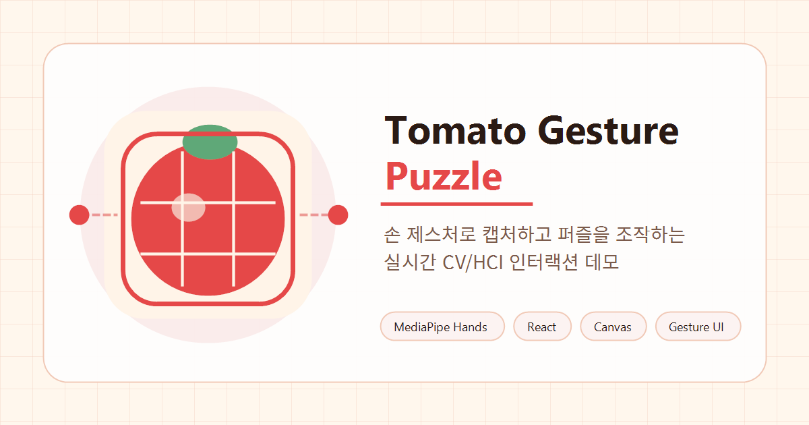

<div align="center">


# Tomato Gesture Puzzle

### 손끝으로 네모를 만들고, 방금 찍은 장면을 퍼즐로 맞추는 tomato-themed CV/HCI 인터랙션 데모

<br />


<br />

**🍅 Hand Tracking · 🤏 Pinch Gesture · 🧩 Adaptive Puzzle · ✨ Magnetic Snap · 🔎 Interaction Replay**

</div>

---

## 🍅 한눈에 보기

**Tomato Gesture Puzzle**은 웹캠 기반 손 추적 결과를 이용해 사용자가 화면 위의 캡처 영역을 직접 만들고, 그 영역을 실시간 퍼즐로 변환해 손 제스처로 조작하는 인터랙션 시스템입니다.

마우스나 터치 없이 양손 pinch gesture만으로 영역 지정, 캡처, 퍼즐 조각 이동, snap, completion, interaction replay까지 이어지는 흐름을 구성했습니다. 단순 퍼즐 게임보다 **Computer Vision + HCI 기반 spatial interaction demo**에 가깝게 설계했습니다.

| 1. 영역 만들기 | 2. 캡처하기 | 3. 퍼즐 맞추기 | 4. 분석 보기 |
| --- | --- | --- | --- |
| 양손 pinch로 네모를 잡습니다 | 선택한 영역이 그 자리에서 snapshot이 됩니다 | 조각을 집고 놓으며 맞춥니다 | 손동작 궤적을 heatmap으로 확인합니다 |



---

## 🧰 Tech Stack

| Category | Stack |
| --- | --- |
| **Frontend** | React 19, TypeScript, Vite |
| **Computer Vision** | MediaPipe Tasks Vision Hand Landmarker |
| **Interaction** | Pinch gesture state machine, hand identity tracking, interaction lock |
| **Rendering** | Canvas 2D direct rendering, requestAnimationFrame loop |
| **Media** | getUserMedia webcam stream, mirrored preview, source-video crop |
| **Audio** | Web Audio SFX, generated WAV background loop |

---

## ✨ Interaction Highlights

### 🍃 Realtime Hand Tracking

- MediaPipe Tasks Vision Hand Landmarker 기반 손 추적
- 양손 21개 landmark skeleton rendering
- handedness, confidence, tracking stability 반영
- unstable frame, jump outlier, lost tolerance 처리
- React state를 매 프레임 갱신하지 않는 canvas direct rendering 구조

### 🤏 Pinch Gesture Interaction

- thumb tip `4`와 index tip `8` 거리 기반 pinch detection
- 손 크기 차이를 보정하는 normalized pinch distance
- `pinch-start`, `pinch-hold`, `pinch-release`, `not-pinching` 상태 관리
- hysteresis, stable frame debounce로 false positive 감소
- 손별 pinch state 독립 관리

### 🍅 Free-form Capture Box

- 양손 pinch point를 rectangle의 diagonal corners로 사용
- 손이 교차해도 `min/max` normalization으로 valid rectangle 유지
- width와 height를 독립적으로 조절
- raw box, smoothed box, confirmed rect 분리
- capture/crop에 사용할 `confirmedRect` 저장

### 📸 Snapshot Capture & Crop

- overlay canvas가 아니라 원본 webcam video frame 기준으로 crop
- mirror preview와 실제 video coordinate 차이 보정
- confirmed rect 영역만 PNG snapshot으로 저장
- capture ready window, simultaneous pinch trigger, cooldown lock 적용
- capture flash feedback 제공

### 🧩 Adaptive Puzzle Generation

- 캡처 영역 크기와 gesture confidence를 기반으로 puzzle difficulty 자동 결정
- 작은 캡처 영역은 2x2, 중간 영역은 3x3, 큰 영역은 4x4로 생성
- tracking jitter가 크거나 gesture confidence가 낮으면 난이도 보정
- hardcoded 3x3/4x4가 아닌 dynamic rows/cols 기반 split
- shuffle 시 어떤 조각도 자기 정답 위치에 남지 않는 derangement shuffle 적용

### ✨ Gesture-based Puzzle Control

- pinch pointer로 puzzle piece grab, drag, drop
- forgiving hit test, grab start window, pointer lost tolerance 적용
- active hand lock, selected piece lock, drag offset freeze로 drag 안정화
- nearest cell drop, magnetic snap preview, snap success feedback
- locked piece visual state와 completion detection 제공

### 🔎 Interaction Analysis Replay

- puzzle interaction 동안 pointer trajectory 기록
- drag path와 체류 영역을 heatmap replay로 시각화
- completion 후 "인터랙션 분석 보기"로 replay mode 진입
- tomato glow는 손동작이 집중된 위치, line은 퍼즐 조작 경로를 표현
- light/dark theme 모두에서 분석 overlay가 보이도록 theme별 렌더링 처리

### 🍅 Tomato Interaction Identity

- tomato red, warm cream, charcoal 기반 visual identity
- light/dark theme toggle
- tomato-themed favicon, Open Graph image, app header mark
- capture, shuffle, snap, lock, completion SFX
- generated ambient BGM loop와 sound mute toggle

---

## 🧩 Interaction Flow

| Step | User Action | System Response |
| --- | --- | --- |
| 1 | 카메라 시작 | webcam stream과 hand tracking loop 시작 |
| 2 | 양손 pinch | 양손 pinch point 사이에 capture box 생성 |
| 3 | 양손을 벌리거나 좁힘 | box width/height가 free-form으로 조절됨 |
| 4 | 양손 release | 현재 box가 confirmed rect로 확정됨 |
| 5 | ready window 안에서 양손 simultaneous pinch | 원본 video frame에서 confirmed rect 영역 crop |
| 6 | snapshot 생성 | 같은 위치에 puzzle board 생성 |
| 7 | puzzle piece 위에서 pinch | piece grab 및 drag 시작 |
| 8 | 원하는 cell에서 release | nearest cell drop, correct cell이면 locked |
| 9 | 모든 piece locked | completion overlay와 interaction replay 진입 |

---

## 🧱 Architecture

```txt
HTMLVideoElement
  -> MediaPipe Hand Landmarker
  -> normalizeHandResults
  -> PinchDetector
  -> VirtualBoundingBoxTracker
  -> SnapshotCaptureManager
  -> PuzzleBoardManager
  -> CanvasRenderer
```

핵심 구조는 realtime loop와 React UI state를 분리하는 것입니다.

```txt
React State
  - camera/runtime phase
  - top-bar instruction
  - theme/debug/sound toggles

Realtime Managers
  - hand tracking frame
  - pinch gesture states
  - virtual bounding box
  - snapshot capture
  - puzzle board
  - interaction sound
  - canvas rendering
```

---

## 🪞 Coordinate Model

웹캠 preview는 사용자가 거울처럼 느끼도록 mirror UX를 적용합니다. 하지만 snapshot은 overlay canvas가 아니라 원본 `HTMLVideoElement`에서 crop합니다.

```txt
Viewer-space Canvas Rect
  -> mirror coordinate correction
  -> canvas-to-video scale mapping
  -> source video crop
  -> PNG snapshot data URL
```

이 구조 덕분에 skeleton, debug text, bounding box overlay가 snapshot 이미지에 섞이지 않습니다.

---

## 📁 Project Structure

```txt
src/
  app/
    App.tsx
    HandTrackingController.ts
    instructionText.ts
  audio/
    interactionSoundManager.ts
  capture/
    snapshotCaptureManager.ts
    snapshotCropper.ts
    snapshotTypes.ts
  config/
    boundingBoxConfig.ts
    captureConfig.ts
    coordinateConfig.ts
    gestureConfig.ts
    mediapipeConfig.ts
    performanceConfig.ts
    puzzleConfig.ts
    trackingStabilityConfig.ts
  interaction/
    boundingBox/
    gestures/
  media/
    camera.ts
  puzzle/
    puzzleBoardManager.ts
    puzzleCompletion.ts
    puzzleGenerator.ts
    puzzleInteraction.ts
    puzzleTypes.ts
  rendering/
    canvasRenderer.ts
    debugOverlay.ts
    heatmapRenderer.ts
    puzzleRenderer.ts
    skeletonRenderer.ts
    virtualBoundingBoxRenderer.ts
  theme/
    themeTokens.ts
    themeTypes.ts
```

---

## 🎨 Public Assets

```txt
public/
  favicon/
    favicon.ico
    favicon-16x16.png
    favicon-32x32.png
    apple-touch-icon.png
  og/
    og-image.png
  sounds/
    bgm_tomato_ambient_loop.wav
```

OG 이미지는 카카오톡, 디스코드, X, 슬랙 공유 카드에 사용됩니다.

```html
<meta property="og:title" content="Tomato Gesture Puzzle" />
<meta
  property="og:image"
  content="https://spatial-gesture-puzzle.vercel.app/og/og-image.png"
/>
```

---

## 🚀 Run Locally

```bash
npm install
npm run dev
```

Vite dev server가 출력하는 localhost 주소로 접속합니다.

```txt
http://127.0.0.1:5173
```

이미 포트가 사용 중이면 Vite가 `5174`, `5175`처럼 다음 포트를 자동으로 사용합니다.

---

## 🎵 Generate BGM

프로젝트에는 15초 loop BGM 생성 스크립트가 포함되어 있습니다.

```bash
npm run generate:bgm
```

생성 파일:

```txt
public/sounds/bgm_tomato_ambient_loop.wav
```

앱에서는 Start 이후 audio context가 unlock되면 낮은 볼륨으로 loop 재생됩니다. Sound toggle은 SFX와 BGM을 함께 제어합니다.

---

## 🛠️ Build

```bash
npm run build
```

---

## 🕹️ Debug HUD

Debug toggle을 켜면 canvas 우측 하단에 compact HUD가 표시됩니다.

표시 항목:

- FPS, detect/render ms
- hand count, jitter, lag
- box/capture phase
- puzzle mode, grid size, locked count
- shuffle validity, fixed piece count
- selected piece, snap distance, replay mode

---

## ✅ Current Status

현재 구현된 범위:

- realtime hand skeleton tracking
- pinch gesture detection
- free-form virtual bounding box
- snapshot capture and crop
- adaptive 2x2/3x3/4x4 puzzle generation
- derangement shuffle
- gesture-based piece grab/drag/drop
- magnetic snap preview
- completion detection
- interaction heatmap replay
- tomato light/dark UI theme
- favicon, OG image, interaction sound, BGM loop
