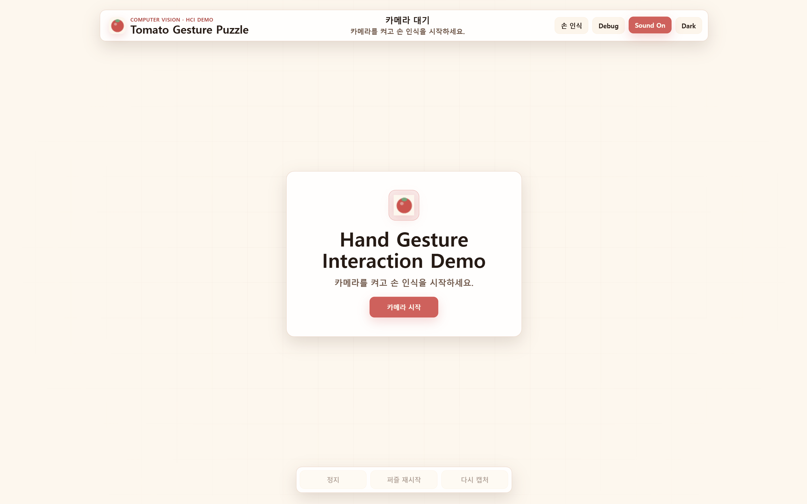
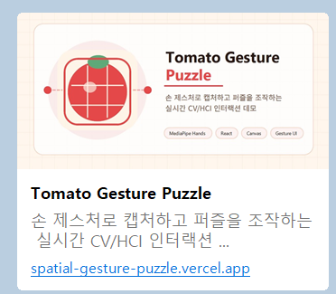

# Tomato Gesture Puzzle 기능명세서

## 0. Hero Section

### Tomato Gesture Puzzle

**손동작으로 화면 위의 공간을 만들고, 그 공간 자체를 퍼즐로 변환하는 실시간 CV/HCI 인터랙션 시스템**

**배포 링크**: [https://spatial-gesture-puzzle.vercel.app/](https://spatial-gesture-puzzle.vercel.app/)



> **이 프로젝트는 단순히 손으로 퍼즐을 맞추는 게임이 아니다.**
>
> 웹캠 기반 hand tracking 결과를 그대로 쓰지 않고, 흔들림과 오차를 보정해 사용자의 조작 의도로 해석한다. 이를 캡처 영역 생성, 퍼즐 난이도 조절, gesture drag/drop, feedback, replay까지 연결한 **interaction-engineered CV/HCI demo**이다.

### 핵심 키워드

| Area | Keywords |
| --- | --- |
| Interaction Engineering | gesture confidence, pointer smoothing, magnetic snap, state-based interaction |
| Adaptive Interaction | dynamic puzzle difficulty, forgiving UX, release grace, pointer lost tolerance |
| Realtime Feedback | tomato ripeness visualization, sound feedback, snap/lock feedback |
| Analysis | heatmap replay, pointer history, interaction confidence visualization |
| Computer Vision | realtime hand tracking, MediaPipe landmarks, tracking stability |

---

## 1. 핵심 차별점 요약

> **첫 페이지 핵심 메시지**
>
> **우리는 손을 인식한 것이 아니라, 불안정한 공중 gesture를 실제로 사용할 수 있는 interaction으로 변환했다.**
>
> 이 프로젝트의 차별점은 hand tracking 자체가 아니다. 차별점은 tracking jitter, 순간적인 손실, pinch 오판, 부정확한 drop 같은 현실적인 문제를 interaction engineering으로 흡수해 **사용자 의도 중심의 조작 경험**을 만든 데 있다.

### 1.1 불안정한 공중 Gesture를 Usable Interaction으로 변환

| 구분 | 내용 |
| --- | --- |
| **문제** | 웹캠 기반 손 추적은 마우스처럼 정밀하지 않다. 손은 흔들리고, pinch는 순간적으로 풀리며, landmark는 잠깐 사라질 수 있다. |
| **해결 방식** | release grace, magnetic snap, pointer lost tolerance, adaptive smoothing, forgiving hit test를 적용해 raw tracking 결과를 그대로 쓰지 않고 사용자 의도로 해석한다. |
| **UX 변화** | 사용자는 손을 완벽히 고정하지 않아도 조각을 잡고 이동하고 놓을 수 있다. 시스템이 조작의 빈틈을 보정하기 때문에 공중 gesture가 실제 usable interaction이 된다. |

> **Punchline**
>
> **Tomato Gesture Puzzle은 hand tracking demo가 아니라, hand tracking을 사용 가능한 interaction으로 안정화한 시스템이다.**

### 1.2 Dynamic NxN Adaptive Puzzle

| 구분 | 내용 |
| --- | --- |
| **문제** | 고정 3x3 퍼즐은 사용자의 캡처 영역이나 gesture 안정도를 반영하지 못한다. |
| **해결 방식** | capture 영역 크기, gesture confidence, tracking jitter를 기반으로 2x2, 3x3, 4x4 puzzle grid를 동적으로 결정한다. |
| **UX 변화** | 시스템이 사용자의 interaction 상태에 적응한다. 작은 영역이거나 조작이 불안정하면 쉬워지고, 안정적인 입력에서는 더 높은 난이도를 제공한다. |

### 1.3 Interaction Heatmap Replay

| 구분 | 내용 |
| --- | --- |
| **문제** | 일반 퍼즐은 완료 결과만 보여주고, 사용자가 어떤 경로로 조작했는지 설명하지 못한다. |
| **해결 방식** | pointer history를 저장하고, 완료 후 drag/hover trajectory를 heatmap replay로 시각화한다. |
| **UX 변화** | 퍼즐 결과뿐 아니라 interaction 과정 자체가 분석 가능한 데이터가 된다. 발표 시 사용자의 손동선과 조작 집중 영역을 보여줄 수 있다. |

### 1.4 Tomato Ripeness Interaction Visualization

| 구분 | 내용 |
| --- | --- |
| **문제** | tracking quality나 gesture confidence를 숫자로만 보여주면 사용자가 상태를 직관적으로 이해하기 어렵다. |
| **해결 방식** | 안정도, jitter, lag, gesture confidence를 tomato ripeness처럼 색상과 빛의 변화로 표현한다. |
| **UX 변화** | 사용자는 현재 interaction이 안정적인지 시각적으로 즉시 이해할 수 있다. technical debug 정보가 interaction feedback으로 전환된다. |

### 1.5 Interaction Sound Design

| 구분 | 내용 |
| --- | --- |
| **문제** | gesture interaction은 손이 화면 위에 떠 있기 때문에 조작이 성공했는지 즉각적인 피드백이 필요하다. |
| **해결 방식** | pinch, capture, shuffle, snap, lock, completion 타이밍에 맞춰 sound feedback을 제공한다. |
| **UX 변화** | 사용자는 시각뿐 아니라 청각으로도 시스템 상태를 인지한다. 조작 성공 여부가 더 명확해지고 demo의 완성도가 높아진다. |

### 기본 구현 기능은 차별점을 지지하는 기반이다

| 기반 기능 | 역할 |
| --- | --- |
| Realtime hand tracking | gesture와 pointer를 만들기 위한 CV 입력 layer |
| Free-form capture box | spatial interaction을 시작하는 사용자 정의 공간 |
| Pinch capture | capture intent를 표현하는 gesture trigger |
| Gesture drag/drop | 퍼즐 조작을 가능하게 하는 interaction command |

**핵심은 이 기능들이 있다는 점이 아니라, 이 기능들을 안정화하고 적응형 feedback으로 연결했다는 점이다.**

---

## 2. 기존 프로젝트와의 차이

### 2.1 일반 웹캠 퍼즐과의 차이

| 일반 웹캠 퍼즐 | Tomato Gesture Puzzle |
| --- | --- |
| 웹캠 이미지를 가져와 퍼즐로 만든다. | 불안정한 손 추적 입력을 usable interaction으로 안정화한다. |
| 퍼즐 조작은 마우스/터치 정확도에 의존한다. | release grace, magnetic snap, pointer tolerance로 공중 gesture의 오차를 보정한다. |
| 난이도는 고정된다. | 캡처 크기와 gesture 안정도에 따라 난이도가 변한다. |
| 완료 여부만 보여준다. | 완료 후 interaction path를 heatmap replay로 보여준다. |
| UI 기능 중심이다. | realtime CV, adaptive feedback, behavior visualization이 결합된다. |

### 2.2 단순 Hand Tracking Demo와의 차이

| 단순 hand tracking demo | Tomato Gesture Puzzle |
| --- | --- |
| 손 skeleton을 화면에 표시한다. | landmark를 interaction state와 사용자 의도로 변환한다. |
| gesture 감지 여부가 핵심이다. | gesture confidence와 tracking stability를 함께 판단한다. |
| 흔들림이나 tracking loss를 사용자가 감수한다. | 시스템이 smoothing, tolerance, magnetic snap으로 보정한다. |
| 결과가 시각 효과에 머문다. | adaptive puzzle, feedback, heatmap replay에 직접 연결된다. |

> **Interaction Engineering 관점**
>
> 이 프로젝트의 핵심은 "손 tracking을 사용했다"가 아니다. 핵심은 불안정한 tracking input을 **사용자가 조작 가능한 안정적인 interaction system**으로 바꾸는 설계이다.

---

## 3. 핵심 Interaction Flow

```txt
Realtime Hand Tracking
  -> Gesture Confidence / Stability Check
  -> Free-form Spatial Capture Box
  -> Simultaneous Pinch Snapshot
  -> Adaptive NxN Puzzle Generation
  -> Gesture-based Drag / Drop
  -> Magnetic Snap / Completion
  -> Interaction Heatmap Replay
```

### Flow Summary

| Step | 사용자 행동 | 시스템 해석 | 결과 |
| --- | --- | --- | --- |
| 1 | 카메라 시작 | hand landmark 추적 | realtime skeleton/input 생성 |
| 2 | 양손 pinch hold | 두 pinch midpoint를 box corner로 해석 | free-form capture box 생성 |
| 3 | 손 간 거리 조절 | box resize 및 smoothing | 공간 캡처 영역 확정 |
| 4 | 양손 simultaneous pinch | capture intent로 판단 | snapshot crop |
| 5 | 캡처 완료 | 면적/안정도 기반 난이도 계산 | 2x2/3x3/4x4 puzzle 생성 |
| 6 | 조각 위 pinch | grab/drag/drop command 생성 | gesture puzzle 조작 |
| 7 | 정답 근처 release | magnetic snap 및 lock | completion 판정 |
| 8 | 완료 | pointer history replay | heatmap interaction analysis |

---

## 4. 프로젝트 개요

Tomato Gesture Puzzle은 웹캠으로 입력되는 손 움직임을 실시간으로 추적하고, 사용자가 공중에서 만든 공간 영역을 퍼즐 인터랙션으로 변환하는 **Computer Vision 기반 HCI 인터랙션 시스템**이다.

이 프로젝트의 목표는 단순히 "웹캠으로 이미지를 찍어서 퍼즐을 푼다"가 아니다. 사용자의 손 제스처를 **공간적 입력 장치**로 해석하고, 그 입력을 캡처 영역 생성, 난이도 조절, 퍼즐 조작, 피드백, 행동 분석까지 연결하는 것이다.



또한 배포 이후 공유 경험까지 고려했다. Open Graph/Twitter preview 이미지를 설정해 링크를 공유했을 때도 프로젝트의 identity와 핵심 기술 키워드가 카드 형태로 노출된다. 이는 발표 자료 외부에서도 프로젝트가 **토마토 테마의 CV/HCI 인터랙션 데모**로 인식되도록 돕는다.

---

## 5. 문제 정의

기존 웹캠 프로젝트는 카메라 화면을 보여주거나 단일 제스처를 감지하는 수준에 머무르는 경우가 많다. 기존 퍼즐 프로젝트 역시 마우스 drag/drop 중심으로 구성되어 입력 방식 자체의 새로움이 약하다.

본 프로젝트는 다음 질문에서 출발했다.

> **사용자의 손동작을 단순 클릭 이벤트가 아니라, 실시간으로 변화하는 공간 인터랙션으로 설계할 수 있는가?**

해결해야 할 문제는 세 가지다.

| 문제 | 설계 방향 |
| --- | --- |
| Hand tracking 데이터는 흔들리고 끊긴다. | tracking stability, gesture confidence, smoothing으로 안정화한다. |
| 공중 gesture는 정밀 조작이 어렵다. | forgiving hit test, release grace, magnetic snap으로 보정한다. |
| 일반 퍼즐은 사용자의 행동을 반영하지 않는다. | 캡처 영역, gesture 안정도, pointer history를 난이도와 replay에 반영한다. |

---

## 6. 핵심 컨셉

본 프로젝트는 손을 마우스 대체 입력으로만 사용하지 않는다. 손의 위치, 양손 간 거리, pinch gesture, tracking stability, pointer movement를 하나의 interaction context로 해석한다.

### Concept Map

| Concept | Description |
| --- | --- |
| **손 = 공간 입력 장치** | 손끝 위치가 단순 포인터가 아니라 캡처 공간의 경계가 된다. |
| **캡처 = 사용자 의도 확정** | simultaneous pinch는 사용자가 현재 공간을 퍼즐 source로 확정했다는 신호다. |
| **퍼즐 = 실시간 CV 결과의 변환물** | puzzle board는 미리 준비된 이미지가 아니라 사용자가 방금 만든 시각적 장면에서 생성된다. |
| **피드백 = 조작 안정화 장치** | snap, sound, ripeness, heatmap은 장식이 아니라 사용자가 interaction 상태를 이해하게 돕는다. |

---

## 7. 주요 기능 정의

### 7.1 Pinch Gesture 기반 Capture

pinch gesture는 엄지 끝과 검지 끝 landmark 사이의 거리를 손 크기로 정규화해 판단한다. pixel 거리만 사용하지 않기 때문에 카메라와 손 사이의 거리 변화에 더 robust하다.

start threshold와 release threshold를 다르게 두어 hysteresis를 적용한다. 손이 미세하게 떨리는 상황에서 pinch 상태가 빠르게 on/off 되는 문제를 줄이기 위한 설계다.

**사용자 경험 영향**: 버튼 없이 손동작만으로 캡처 의도를 전달할 수 있고, 우발적인 손 모양 변화가 바로 캡처로 이어지지 않는다.

### 7.2 Realtime Bounding Box Resize

양손의 pinch midpoint를 가상 사각형의 두 대각선 모서리로 해석한다. 사용자가 손을 벌리거나 좁히면 bounding box가 실시간으로 resize된다.

box는 화면 좌표 안에서 clamp되고 smoothing을 거쳐 렌더링된다. 양손 tracking이 순간적으로 끊겨도 confirmed rect와 lost tolerance를 통해 상태가 즉시 무너지지 않도록 했다.

**사용자 경험 영향**: 정해진 crop UI를 조작하는 것이 아니라, 실제 손동작으로 화면 공간을 잡아 늘리는 느낌을 제공한다.

### 7.3 Snapshot Crop

confirmed capture rect는 viewer-space canvas 좌표에서 source video crop 좌표로 변환된다. overlay나 skeleton이 snapshot에 섞이지 않고, 원본 video frame의 해당 영역만 puzzle source로 사용된다.

**사용자 경험 영향**: 사용자가 선택한 영역이 퍼즐 이미지로 자연스럽게 이어진다.

### 7.4 NxN Adaptive Puzzle Generation

퍼즐은 고정 3x3이 아니라 2x2, 3x3, 4x4로 동적으로 생성된다. grid size는 캡처 영역 비율, gesture confidence, tracking jitter를 함께 고려한다.

| 조건 | 난이도 영향 |
| --- | --- |
| 캡처 영역이 작음 | 2x2 중심으로 완화 |
| 캡처 영역이 큼 | 4x4 가능 |
| gesture confidence 낮음 | 난이도 하향 |
| tracking jitter 높음 | 난이도 하향 |
| gesture 안정도 높음 | 더 높은 난이도 허용 |

**사용자 경험 영향**: 사용자가 시스템에 맞추는 것이 아니라, 시스템이 사용자의 현재 조작 상태에 맞춰 난이도를 조절한다.

### 7.5 Puzzle Shuffle

퍼즐 조각은 original index와 current index를 분리해 관리한다. shuffle 시 모든 조각이 처음부터 제자리에 있는 상태를 피하기 위해 derangement 방식이 적용된다.

**기술적 고민**: puzzle이 시작하자마자 이미 맞춰진 상태가 되지 않도록 shuffle validity를 관리한다.

### 7.6 Gesture-based Drag/Drop

퍼즐 조각은 pinch start 시 선택되고, pinch hold 동안 pointer를 따라 이동하며, pinch release 후 nearest cell에 drop된다.

pointer는 손 전체 중심이 아니라 엄지와 검지의 midpoint를 사용한다. 사용자가 실제로 "집는" 위치와 화면상의 조작점이 일치하도록 하기 위한 선택이다.

### 7.7 Magnetic Snap

조각이 drop target에 가까워지면 snap preview와 magnetic attraction이 적용된다. 사용자가 정확히 셀 중앙에 놓지 않아도 의도한 위치로 정렬된다.

**사용자 경험 영향**: 공중 gesture 조작의 본질적인 불안정성을 인정하고, 사용자의 의도를 보정하는 forgiving interaction을 제공한다.

### 7.8 Completion/Reset Flow

모든 조각이 정답 위치에 locked 되면 completed 상태로 전환된다. 완료 후에는 interaction replay가 실행되고, 이후 reset 또는 new capture flow로 이어질 수 있다.

### 7.9 Sound Interaction Feedback

capture, snap, completion 같은 상태 변화에 맞춰 sound feedback을 제공한다. 사용자가 화면을 계속 주시하지 않아도 interaction 상태 변화를 인지할 수 있다.

### 7.10 Dark/Light Tomato Theme

토마토 컬러를 중심으로 dark/light theme을 제공한다. theme은 단순 색상 변경이 아니라 capture, puzzle, heatmap, ripeness feedback의 시각적 일관성을 만든다.

---

## 8. 기술 구조

```txt
Webcam Stream
  -> MediaPipe Hand Landmarker
  -> Hand Normalization / Smoothing
  -> Pinch Gesture Detection
  -> Virtual Bounding Box Tracking
  -> Snapshot Capture
  -> Adaptive Puzzle Generation
  -> Gesture Puzzle Interaction
  -> Canvas Rendering / Feedback / Replay
```

| Module | Responsibility |
| --- | --- |
| `tracking` | hand landmark 정규화, smoothing, tracking state 관리 |
| `interaction` | pinch gesture, interaction confidence, bounding box logic |
| `capture` | snapshot crop, capture state, cooldown, simultaneous pinch validation |
| `puzzle` | adaptive puzzle generation, shuffle, drag/drop, completion detection |
| `rendering` | skeleton, bounding box, puzzle, heatmap, HUD, ripeness visualization |
| `audio` | interaction sound feedback |
| `theme` | tomato 기반 dark/light visual token |
| `public/og` | 링크 공유 시 노출되는 Open Graph preview image |
| `docs/first-screen-camera-ready-preview.png` | 앱 진입 시 표시되는 camera-ready 첫 화면 preview capture |
| `docs/social-share-preview-card.png` | 실제 공유 카드가 어떻게 보이는지 보여주는 문서용 preview capture |

React는 앱 phase, theme, control UI를 담당한다. 매 frame 갱신되는 hand landmark와 puzzle interaction은 Canvas 중심의 realtime loop에서 처리한다. 이는 React render cycle이 realtime gesture loop를 방해하지 않도록 하기 위한 구조적 선택이다.

### 8.1 배포 및 공유 메타데이터

프로젝트는 Vercel 배포 URL을 기준으로 Open Graph와 Twitter card metadata를 설정했다. 공유 시 `public/og/og-image.png`가 large preview image로 노출되며, title, description, image alt text가 함께 제공된다.

**공유 미리보기 구성 요소**

| 요소 | 내용 |
| --- | --- |
| 프로젝트명 | Tomato Gesture Puzzle |
| 핵심 설명 | 손 제스처로 캡처하고 퍼즐을 조작하는 실시간 CV/HCI 인터랙션 |
| 대표 이미지 | tomato grid와 gesture/puzzle identity를 보여주는 Open Graph image |
| 링크 카드 | 배포 URL 공유 시 시각적으로 정리된 카드 형태로 표시 |

---

## 9. UX 설계 포인트

### 9.1 첫 화면에서 전달되는 프로젝트 정체성

첫 화면은 사용자가 시스템에 진입하는 순간부터 이 프로젝트가 일반 퍼즐 앱이 아니라 **Computer Vision · HCI demo**라는 점을 전달하도록 설계되어 있다.

- 상단에 프로젝트명과 `COMPUTER VISION · HCI DEMO` 라벨 배치
- 중앙에 `Hand Gesture Interaction Demo` 메시지 배치
- 카메라 시작 버튼을 통해 손 인식 기반 interaction으로 즉시 진입
- 손 인식, debug, sound, theme toggle을 첫 화면에서 제어

### 9.2 사용자의 의도를 우선하는 Forgiving UX

손 추적 기반 interaction은 마우스보다 불안정하다. 따라서 이 프로젝트는 사용자의 입력을 엄격한 좌표 판정으로만 처리하지 않는다.

| 설계 요소 | 목적 |
| --- | --- |
| hit padding | 조각 주변 여유 영역까지 grab 허용 |
| center grab radius | 손끝이 약간 빗나가도 의도한 조각 선택 |
| release grace frame | 순간적인 pinch release 오판 방지 |
| pointer lost tolerance | tracking이 잠깐 끊겨도 조작 유지 |
| magnetic snap | 정밀하지 않은 drop을 의도한 위치로 보정 |
| adaptive smoothing | 느린 움직임은 부드럽게, 빠른 움직임은 즉각 반응 |

### 9.3 공간 조작감을 주는 Capture UX

일반적인 crop UI는 마우스로 박스를 조절한다. 본 프로젝트는 두 손의 위치를 박스의 대각선 모서리로 사용한다.

**사용자는 화면 속 공간을 클릭하는 것이 아니라, 손으로 직접 공간을 잡아 늘리는 경험을 한다.**

### 9.4 Feedback as Interaction Guidance

시스템은 결과만 보여주지 않는다. 현재 조작이 얼마나 안정적인지, 어떤 cell에 snap될 가능성이 있는지, 어떤 조작 경로를 거쳤는지를 지속적으로 피드백한다.

특히 tomato ripeness visualization은 tracking quality, gesture confidence, jitter, pointer lag를 하나의 이해하기 쉬운 시각 은유로 표현한다.

---

## 10. Interaction Engineering 포인트

### 10.1 Gesture Confidence

gesture confidence는 단순히 pinch가 감지되었는지를 넘어서, tracking quality와 pinch stability를 함께 고려한다. snapshot에는 gesture confidence와 tracking jitter가 기록되고, 퍼즐 난이도 계산에도 사용된다.

### 10.2 Tracking Stability

hand tracking 결과는 매 frame마다 변동될 수 있다. 따라서 raw landmark를 그대로 interaction에 사용하지 않고, stable hand만 bounding box 편집에 사용한다.

관리 요소는 다음과 같다.

- tracking quality
- jump distance
- jitter
- lost frame count
- stable hand count

### 10.3 Spatial Interaction State

pinch gesture는 현재 phase에 따라 다른 의미를 가진다.

| Phase | Pinch Meaning |
| --- | --- |
| bounding box 단계 | capture box editing |
| capture ready 단계 | simultaneous snapshot trigger |
| puzzle 단계 | grab / drag / drop |
| completed 단계 | interaction lock 또는 reset flow |

같은 gesture라도 context에 따라 의미가 달라지므로, 단순 이벤트 매핑이 아니라 state 기반 interaction design이 필요하다.

### 10.4 Realtime CV와 Puzzle Logic의 결합

MediaPipe 결과는 skeleton을 그리는 데서 끝나지 않는다. landmark는 bounding box, capture trigger, puzzle pointer, drag state, feedback visualization까지 연결된다.

**CV 결과를 시각 효과가 아니라 application logic의 핵심 입력으로 사용한다는 점이 이 프로젝트의 기술적 차별점이다.**

### 10.5 사용자 행동 기반 분석

퍼즐 조작 중 pointer history는 hover와 dragging 상태를 구분해 저장된다. 완료 후 heatmap replay는 사용자가 어떤 영역에서 많이 움직였고, 어떤 경로로 조각을 이동했는지 보여준다.

이는 프로젝트가 단순 interactive toy가 아니라, 사용자 행동을 관찰하고 해석할 수 있는 HCI demo임을 보여준다.

---

## 11. 기대 효과

| 기대 효과 | 설명 |
| --- | --- |
| CV/HCI 차별성 강화 | hand tracking을 화면 표시가 아니라 interaction system으로 확장한다. |
| 발표 설득력 향상 | 첫 화면, flow, heatmap replay로 "무엇이 특별한지"를 즉시 보여준다. |
| 사용성 개선 | forgiving UX로 공중 gesture 조작의 실패 가능성을 줄인다. |
| 분석 가능성 확보 | pointer history와 heatmap을 통해 사용자 행동을 설명할 수 있다. |
| 프로젝트 완성도 강화 | 배포 링크, 공유 카드, theme, sound까지 포함해 demo identity를 만든다. |

---

## 12. 시연 흐름

발표 시연은 아래 순서가 가장 효과적이다.

1. **첫 화면**
   `Computer Vision · HCI Demo` 라벨과 camera start flow로 프로젝트 정체성을 먼저 보여준다.

2. **Realtime Hand Tracking**
   손 skeleton과 landmark가 webcam 위에 실시간으로 표시되는 것을 보여준다.

3. **Free-form Capture Box**
   양손 pinch로 캡처 영역을 만들고, 손을 벌리거나 좁혀 box가 resize되는 것을 보여준다.

4. **Snapshot Capture**
   양손 simultaneous pinch로 현재 영역이 snapshot으로 고정되는 장면을 보여준다.

5. **Adaptive Puzzle Generation**
   캡처 영역과 조작 안정도에 따라 NxN puzzle이 생성되는 것을 설명한다.

6. **Gesture Drag/Drop**
   pinch로 조각을 잡고 움직이며, magnetic snap과 locked feedback을 보여준다.

7. **Forgiving UX**
   손이 조금 흔들려도 조각이 의도한 위치로 snap되고, pointer loss나 release grace가 조작 실패를 줄인다는 점을 설명한다.

8. **Completion & Heatmap Replay**
   퍼즐 완료 후 interaction heatmap replay를 보여주며, 사용자의 조작 경로가 분석 가능한 데이터로 남는다는 점을 강조한다.

---

## 13. 결론

Tomato Gesture Puzzle은 단순히 손으로 퍼즐을 맞추는 게임이 아니다. webcam, hand landmark, pinch gesture, spatial capture, adaptive puzzle generation, forgiving drag/drop, heatmap replay를 하나의 흐름으로 결합한 **실시간 CV/HCI interaction system**이다.

가장 중요한 차별점은 기능의 개수가 아니다. 각 기능이 사용자의 행동을 더 안정적으로 해석하고, 더 자연스러운 공간 조작 경험을 만들기 위해 설계되었다는 점이다.

> **최종 한 줄 정의**
>
> Tomato Gesture Puzzle은 손 제스처로 화면 공간을 만들고, 그 공간을 퍼즐로 변환하며, 사용자의 조작 과정을 실시간으로 해석하고 피드백하는 CV/HCI 기반 gesture interaction system이다.
